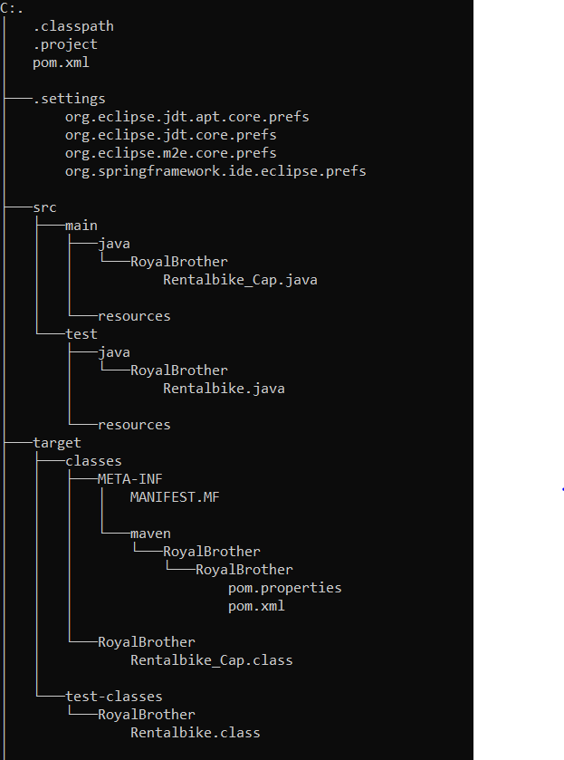

# Royal Brothers - (Appium with Java Testing)

## Introduction

This project centers on automating the testing of the "TARIFFS", "Offers" etc section of the Royal Brothers application. The main objective is to ensure that users can seamlessly navigate, browse rental options, and apply filters to select products, providing them with a smoother and more efficient shopping experience. The automated testing aims to verify the functionality and performance of these key features for improved usability.

## Project Type

- Mobile Automation Testing
- Frontend Testing
- Software Automation Engineer in Test (SDET)

## Directory Structure

The project is organized as follows:
C:\Users\Abhisek Baral\Documents\workspace-spring-tool-suite-4-4.23.1.RELEASE\RoyalBrother

## Video Walkthroughs

- **Project Overview:** [Watch Here](https://www.youtube.com/watch?v=XNTC-bOnW8s)
- **Project questionnaire:** [Watch Here](https://youtu.be/LAWTVI4Wi4M?si=O3eUkzoVhmgTWFyh)

## Features

1. Users can select vehicle from the "TARIFFS" section Categories.
2. Users can book bike for rental
3. User can choose bike as per favorite

## Design Decisions & Assumptions

The project is designed with the following categories:

- **Selecting City**
  - **User's Top Picks**
    - **VIEW ALL**
      - Hoourly
      - 7 Days
      - 15 Days
      - Book bike
      - Selecting date
    - **Search Function**
      - Scooty & Bikes
    - **Offers**
      - Offers
      - Coupons

## Installation & Getting Started

To set up and start the project, follow these steps:

1. Open the project in Spring Tool Suite.
2. Create a new Maven project.
3. Add the necessary dependencies and create packages.
4. Create a Java class for the testing script.
5. Write Java-Testng scripts to automate the test cases.

## Functionality Usage

1. Open the RoyalBrothers app in a Emulator.
2. Tap on “SKIP” (Registration).
3. Select “Bangalore”.
4. Scroll down and tap on “Royal Enfield Meteor Supernova 650” (or any available bike).
5. Select the date and time for pickup and dropoff, and check availability.
6. Navigate to OFFERS, then User’s Top Picks.
7. Use the Search by Model feature and select Honda Activa 6G.
8. Perform other interactions like taps, scrolls, and clicks as needed.
9. Return to the home page.
10. Close the application

## Technology Stack

- Java
- Appium
